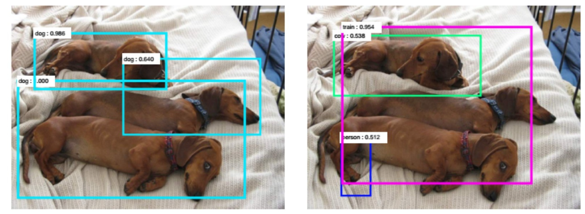
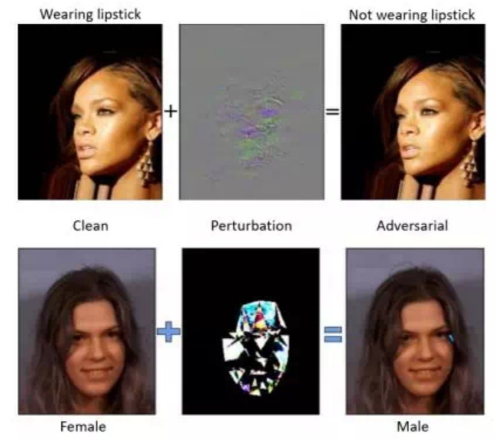
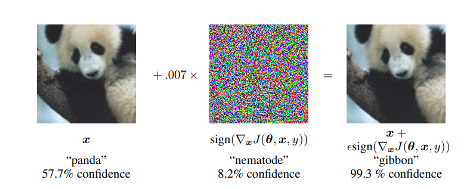

对抗攻击

# 0 引言

​		随着电脑性能提升，尤其是GPU被广泛应用于深度学习（deep learning）之后，深度神经网络(Deep neural network, DNN)已经是一个解决现实问题的首选。神经网络的发展也产生了许多新的课题，比如应对越来越复杂的网络模型，产生了神经网络剪枝或者蒸馏的课题；为了提高网络泛化能力，提出了越来越多的[数据增广](https://github.com/guchengxi1994/mask2json)方案，就为了在那些开源的数据集上提升1%的精度。对抗攻击某种意义上也可以看成是神经网络过拟合的一个弊病，一般来说通过数据增广可以规避一些被攻击的风险。

# 1 什么是对抗攻击

​		对抗攻击英文为adversarial attack，即对输入样本故意添加一些人无法察觉的细微的干扰，导致模型以高置信度给出一个错误的输出。打个比方，在一些分类模型中，对输入图像加入一些椒盐噪声之后，分类的置信度降低甚至可能得到一个完全不一样的结果。如果分类器模型精度不高，把狗识别成为猫，最多被人戏称为人工智障，详见图1。但是如果人脸识别或者其他广泛应用于生活中的算法被证实是[不可靠](https://www.sohu.com/a/129214410_418390)的，那么自己的人脸可能反倒可能成为自己信息泄露的推手了。（题外话：其实当前的AI并不能模拟人类的思维，因为人类的主观思维能力是很难被模拟的。比如广泛应用的身份证OCR技术，前几年百度的OCR并不能很好的应对身份证旋转或者镜面翻转的情况，但是近期再次尝试的时候已经可以应对这些异常情况了。这并不可能是因为模型升级了，反倒有可能是人为地添加了识别异常时尝试旋转或者翻转重新尝试一遍，或者是按照身份证的排版做了一个模板，使用文字检测的时候通过模板去匹配可能的身份证摆放位置，然后再进行检测。因为文字识别以及检测的时候尝试翻转以及旋转意义不大，像“6”以及“9”这样的文字，旋转一下意义完全不一样）

​                              图 1   左图是原始图像，右图是加入人为扰动后的图像。左图中三只狗被正确识别，

​														而右图中三只狗却被分别识别为火车，人以及汽车

​		

​		对抗攻击的原理，简而言之就是，深度神经网络通过特征提取的方式提取输入图片特征，但是具体提取了什么特征以及为什么提取这个特征不知道（由训练模型所使用的数据集以及训练中设置的参数决定）。所以我们需要试图找到那个模型认为很重要的位置，然后尝试着去改变这个位置的像素值，使得DNN对输入做出一个误判。如图2所示。

​						图2    通过对原始图像加入一些人造的扰动，可以使模型在分类层面发生误判的情况，

​														而这些扰动其实人眼使比较难分辨出来的

# 2. 对抗攻击的方式

​		（1）白盒攻击，称为White-box attack，也称为open-box 对模型和训练集完全了解，这种情况比较简单，但是实际场景中，一般很难知道所采用的数据集以及模型结构。

​		（2）黑盒攻击，称为Black-box attack，对模型不了解，对训练集不了解或了解很少。这种攻击和实际情况比较符合，主要也是主要研究方向。

​		（3）定向攻击，称为targeted attack，对于一个多分类网络，把输入分类误判到一个指定的类上。比如要是别0~9十个数字的一个简单神经网络模型，攻击的目标就是识别过程中，将所有的数字A识别成数字B。

​		（4）非定向攻击，称为non-target attack，只需要生成对抗样本来欺骗神经网络，可以看作是上面的一种特例。用上面的例子也就是将所有的数字A识别成任意的非A的其他数字。

# 3. 对抗攻击发展历史与方法分类

## 3.1 基于梯度（Gradient-Based）的对抗攻击

​		2014年，Ian Goodfellow（就是他提出了生成对抗神经网络GANs）等人发表的[Intriguing Properties of Neural Networks](https://arxiv.org/pdf/1312.6199.pdf)这篇论文，阐述了以下观点：

​		神经网络具有强大的表现能力，但是其学习的特征往往是无法解释的（打个比方，传统的机器学习方法，比如我们设计了一个以灰度高低为核心的简单分类器，认为灰度在某个区间内的部分是图像的前景部分，其余的为背景，而这个设定的区间是可以人为解释的，比如前景大量的是红色的，所以RGB阈值区间的R的取值较高，其余取值较低；而如果是DNN来做这种分隔的话，考虑简单的[UNet](https://link.zhihu.com/?target=https%3A//arxiv.org/abs/1505.04597),[模型详解](https://zhuanlan.zhihu.com/p/313283141)，在每一次卷积训练得到的参数都是精度64的浮点数，与训练数据强相关，但是并不清楚为什么是这个数），文章中将这种情况做了解释（1）神经网络的高层中包含语义信息的是整个空间，而不是某个单元（2）神经网络学习的输入-输出是不连续的，增加某些扰动可以使网络产生错误的分类。并定义了带有扰动的输入被称为对抗样本(adversarial examples) （3）对抗样本的鲁棒性很强，相同的扰动会导致在数据集的不同子集上进行训练的不同网络对相同输入进行错误分类。

​		在这三条论点基础上，有很多相关研究工作。

​		（1）Goodfellow等人在2014年提出了提出了快速梯度符号方法（[FGSM](https://arxiv.org/pdf/1412.6572.pdf)）以生成具有单个梯度步长的对抗性示例。在进行反向传播之前，该方法用于扰动模型的输入，这是对抗训练的早期形式，论文中有一用例如图3所示。

​				图3   左一在一般分类器分类过程中判别为一只熊猫，但是加上了通过神经网络生成的梯度攻击噪声之后，虽然在人类视觉中感受不到差异，但是模型却将其分类为长臂猿了。

​		那么FGSM的攻击噪声是怎么生成的呢？我们知道训练分类模型时，网络基于输入图像学习特征，然后经过softmax层得到分类概率，接着损失函数基于分类概率和真实标签计算损失值，回传损失值并计算梯度（也就是梯度反向传播），最后网络参数基于计算得到的梯度进行更新，网络参数的更新目的是使损失值越来越小，这样模型分类正确的概率也就越来越高。常规的分类模型训练在更新参数时都是将参数减去计算得到的梯度，这样就能使得损失值越来越小，从而模型预测对的概率越来越大。既然无目标攻击是希望模型将输入图像错分类成正确类别以外的其他任何一个类别都算攻击成功，那么只需要损失值越来越大就可以达到这个目标，也就是模型预测的概率中对应于真实标签的概率越小越好，这和原来的参数更新目的正好相反。因此我只需要在输入图像中加上计算得到的梯度方向，这样修改后的图像经过分类网络时的损失值就比修改前的图像经过分类网络时的损失值要大，换句话说，模型预测对的概率变小了。这就是FGSM算法的内容，一方面是基于输入图像计算梯度，另一方面更新输入图像时是加上梯度，而不是减去梯度，这和常见的分类模型更新参数正好背道而驰。

​		（2）SM Moosavi-Dezfooli等人在2015年提出的[DeepFool](https://arxiv.org/pdf/1511.04599.pdf)通过计算出最小的必要扰动，并应用到对抗样本构建的方法，使用的限制扰动规模的方法是L2范数，得到比较优的结果，具体实现可以参考这篇[博客](https://www.leiphone.com/category/ai/koeGa9d5MRm7QdYZ.html)，解释的相当透彻。

​		（3）N Papernot等人在2015年的时候提出的[JSMA](https://arxiv.org/abs/1511.07528)，通过计算神经网络前向传播过程中的导数生成对抗样本。具体实现可以参考这篇[博客](https://chaoge123456.github.io/%E5%AF%B9%E6%8A%97%E6%A0%B7%E6%9C%AC%E7%94%9F%E6%88%90%E7%B3%BB%E5%88%97%EF%BC%9AJSMA%E7%9B%AE%E6%A0%87%E6%89%B0%E5%8A%A8.html/)。

​		（4）Florian Tramèr等人在2017年通过添加称为R + FGSM的随机化步骤来增强此攻击，后来，基本迭代方法对FGSM进行了改进，采取了多个较小的FGSM步骤，最终使基于FGSM的对抗训练均无效。

​		（5）N Carlini,D Wagner等人在2017年提出了一个更加高效的优化问题，能够以添加更小扰动的代价得到更加高效的对抗样本。

## 3.2 基于变换（Transfer-based）的对抗攻击

​		基于Transfer的攻击不依赖模型信息，但需要有关训练数据的信息。
​		Nicolas Papernot等人在2017年的时候利用训练数据，训练出可以从中生成对抗性扰动的完全可观察的替代物模型。Liu等人2016年的时候在论文[SafetyNet: Detecting and Rejecting Adversarial Examples Robustly](https://arxiv.org/abs/1704.00103)证明了：如果在一组替代模型上创建对抗性示例，则在某些情况下，被攻击模型的成功率可以达到100％。

## 3.3 基于打分（Score-based）的对抗攻击

（1）B. Ru, A. Cobb等人在2020年发表文章[BayesOpt Adversarial Attack](https://link.zhihu.com/?target=https%3A//openreview.net/forum%3Fid%3DHkem-lrtvH)利用了贝叶斯优化来以高查询效率找到成功的对抗扰动。此外该论文还通过采用可替代的代理结构来减轻通常针对高维任务的优化挑战，充分利用了我们的统计替代模型和可用的查询数据，以通过贝叶斯模型选择来了解搜索空间的最佳降维程度。

（2）L. Meunier等人在2020年发表文章[Yet another but more efficient black-box adversarial attack: tiling and evolution strategies](https://link.zhihu.com/?target=https%3A//arxiv.org/abs/1910.02244)利用了evolutional algorithms。通过结合两种优化方法实现了无导数优化。

（3）J. Du等人在2020年发表了文章[Query-efficient Meta Attack to Deep Neural Networks](https://link.zhihu.com/?target=https%3A//arxiv.org/abs/1906.02398)采用了meta learning来近似估计梯度。该方法可以在不影响攻击成功率和失真的情况下，大大减少所需的查询次数。 通过训练mata attacker，并将其纳入优化过程以减少查询数量。

# 4. 对抗攻击的其他场景

​		对抗样本攻击首先在image attack中被提出，并得到充分发展。其中主要是在分类与识别场景的神经网络的攻击上。

​		同时，对抗样本攻击也在自编码器和生成模型，在循环神经网络，深度强化学习，在语义切割和物体检测等方面也有应用。

​		(1)强化学习（Reinforce learning）：Lin等人在[Tactics of adversarial attack on deep reinforcement learning agents](https://link.zhihu.com/?target=https%3A//arxiv.org/abs/1703.06748)提出了两种不同的针对深度强化学习训练的代理的对抗性攻击。在第一种攻击中，被称为策略定时攻击，对手通过在一段中的一小部分时间步骤中攻击它来最小化对代理的奖励值。提出了一种方法来确定什么时候应该制作和应用对抗样本，从而使攻击不被发现。在第二种攻击中，被称为迷人攻击，对手通过集成生成模型和规划算法将代理引诱到指定的目标状态。生成模型用于预测代理的未来状态，而规划算法生成用于引诱它的操作。这些攻击成功地测试了由最先进的深度强化学习算法训练的代理。

​		(2)循环神经网络：2016年Papernot等人在[Crafting adversarial input sequences for recurrent neural networks](https://link.zhihu.com/?target=https%3A//ieeexplore.ieee.org/abstract/document/7795300/)提出

​		(3)语义切割和物体检测：2018年Carlini N等人在[Audio adversarial examples: Targeted attacks on speech-to-text](https://link.zhihu.com/?target=https%3A//ieeexplore%3C/u%3E.%3Cu%3E%3Cb%3Eieee.org/abstrac%3C/b%3E%3C/u%3Et%3Cu%3E/d%3C/u%3Eo%3Cu%3E%3Cb%3Ecument%3C/b%3E/%3Cb%3E84%3C/b%3E2%3Cb%3E4625%3C/b%3E%3C/u%3E/)提出

# 5. 对抗训练与对抗防御方法最新总结

​		(1) V Zantedeschi等人在2017年发表文章[Efficient defenses against adversarial attacks](https://link.zhihu.com/?target=https%3A//dl.acm.org/doi/abs/10.1145/3128572.3140449)提出了一种双重防御方法，能够在对原来模型标准训练代价影响较小的情况下完成配置。防御从两个方面入手，其一是通过改变ReLU激活函数为受限的ReLU函数以此来增强网络的稳定性。另一方面是通过高斯数据增强，增强模型的泛化能力，让模型能将原始数据和经过扰动后的数据分类相同。

​		(2) A Athalye等人在2018年的时候发表文章[Obfuscated gradients give a false sense of security: Circumventing defenses to adversarial examples](https://link.zhihu.com/?target=https%3A//arxiv.org/abs/1802.00420)在文章中提到 发现了一种「混淆梯度」（obfuscated gradient）现象，它给对抗样本的防御带来虚假的安全感。在案例研究中，试验了 ICLR 2018 接收的 8 篇论文，发现混淆梯度是一种常见现象，其中有 7 篇论文依赖于混淆梯度，并被的这一新型攻击技术成功攻克。

​		(3) A Shafahi等人在2019年发表文章[Universal adversarial training](https://link.zhihu.com/?target=https%3A//arxiv.org/abs/1811.11304)。作者通过使用交替或同时随机梯度方法优化最小-最大问题来训练鲁棒模型来防御universal adversarial attack。 同时证明了：使用某些使用“归一化”梯度的通用噪声更新规则，这是可能的。

​		(4) P Maini等人在2019年的时候发表文章[Adversarial Robustness Against the Union of Multiple Perturbation Models](https://link.zhihu.com/?target=https%3A//arxiv.org/abs/1909.04068)。在文中，作者证明了在针对多个Perturbation模型的联合进行训练时，对抗训练可以非常有效。 同时作者还比较了对抗训练的两个简单概括和改进的对抗训练程序，即多重最速下降，该方法将不同的扰动模型直接合并到最速下降的方向。

​		(5) R Zhai等人在2020年发表文章MACER: [Attack-free and Scalable Robust Training via Maximizing Certified Radius](https://zhuanlan.zhihu.com/p/104532285/https://arxiv.org/abs/2001.02378)这是一种无攻击且可扩展的鲁棒的训练方法，它可以直接最大化平滑分类器的认证半径。同时文章证明了对抗性训练不是鲁棒的训练的必要条件，基于认证的防御是未来研究的有希望的方向。

# 6. 对抗攻击存在的价值

​		DNN在很多方面已经展示出比人类要好的水平,比如图片分类,翻译等等。

​		DNN的可攻击性，导致了DNN在一些重要领域之内无法大规模部署，极大的限制了DNN的发展。

​		对对抗攻击有了比较深入的理解之后,才能对对抗防御有比较深入的理解。

# 7. 攻击有多简单呢

​		2017年的一篇论文[One Pixel Attack for Fooling Deep Neural Networks](https://arxiv.org/pdf/1710.08864.pdf),研究发现只需要修改原图像中的一个像素，就可以让一个分类网络分类错误。