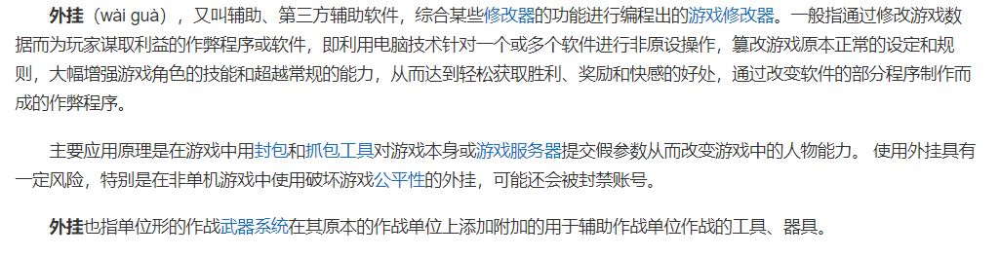

首先需要申明一点，我自己并不是一个十足的WOW粉丝，对这款游戏的接触不是很多。不过身边很多人都是这个游戏的忠实爱好者，直到国服关闭。

这对我来说倒不算什么，毕竟我喜欢大菠萝甚于山口山。

***

### 1.什么是游戏外挂

简单来说，就是用外挂做一些你本来在游戏中做不到或者不应该做的事情。*我在一些单机游戏中会使用这些外挂，比如刷材料刷的累了，boss打不过去了等等情况。当然，也有一些比较有意思的修改器，比如大菠萝2的大箱子。*

### 2. 按键精灵和鼠标宏算不算外挂

广义上来看，算。

### 3. 如何甄别外挂

说实话，外挂五花八门，各种游戏都有，不是游戏的玩家很难看出来是不是使用了这些工具。据说早期山口山GM甄别玩家是否开了自动寻路自动做任务这些插件，会空降到玩家身边要求玩家操作角色跳舞🤣。

所以外挂是门技术，识别外挂也算。

### 4. 那么AI能做什么呢

