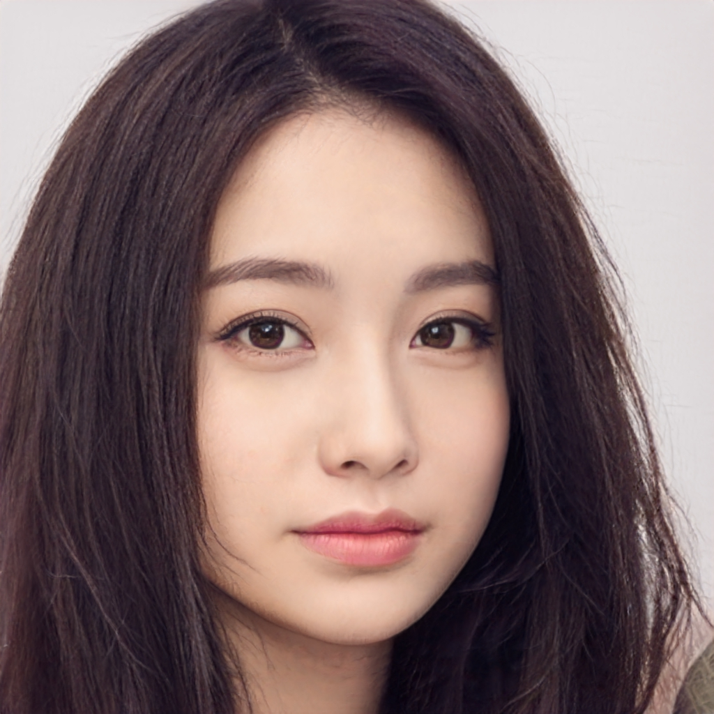
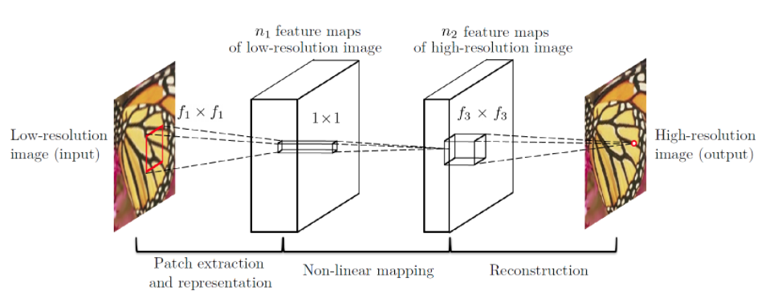
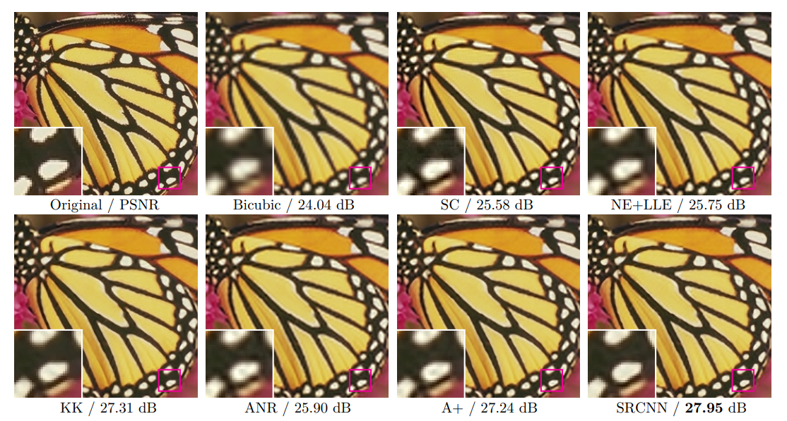
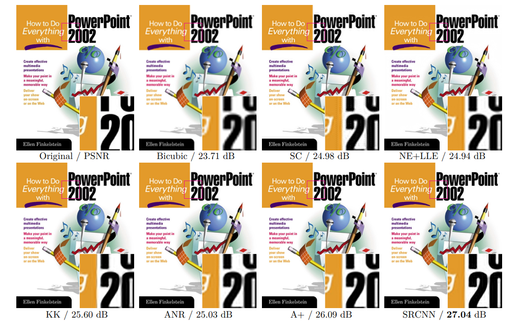
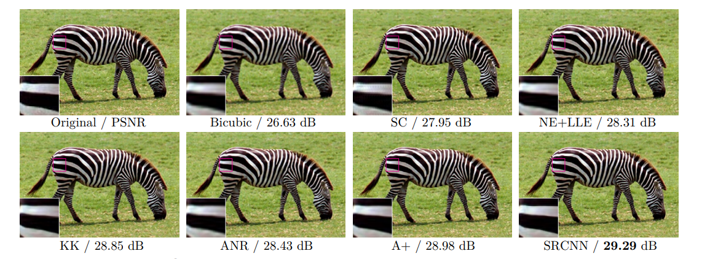
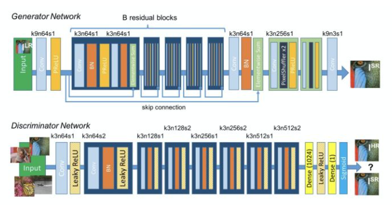
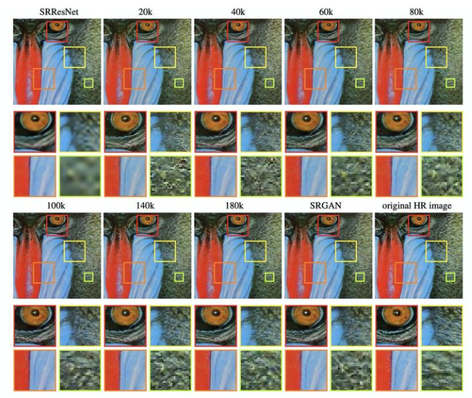

<center><font size='30'>超分到底能为我们做什么</font></center>

<center><font size='25'>What can super-resolution do</font></center>

​		超分（super-resolution，SR）是热门的图像、视频处理技术，旨在将低分辨率图像或者视频通过一些列手段转变为高分辨率影像，在监控设备、卫星图像和医学影像等领域都有重要的应用价值。

## 1. 简介

​		图像分辨率是图像的一个重要参数，反映的是是每英寸图像内有多少个像素点（DPI, dots per inch）。一般来说，分辨率越高，图像在放大过程中越不容易出现失真的情况。然而，高分辨率意味着同一尺寸的图像存储占用的空间越大，在图像传输过程中需消耗更多的时间以及资源。因此，需开发从低分辨率到高分辨率转换的算法，达到节约时间、空间的目的。

|                高分辨率图像                |               低分辨率图像                |
| :----------------------------------------: | :---------------------------------------: |
|  |  |
|              （a）高分辨率图               |               (b)低分辨率图               |

​				图1 高分辨率与低分辨率图像对比。图(a)为高分辨率图，进行[处理](#code-1)之后产生图（b）低分辨率图。高分辨率的图像在展示细节上更加清晰，高分辨率占用存储空间479kb，低分辨率占用存储空间165kb。

​		尽管从高分辨率到低分辨率的转化是一件很简单的事情，但是相反的转化却一直是一个具有挑战性且意义重大的课题。从上世纪八九十年代开始，就有一些论文阐述了相关的算法。1984年，Tsai等人[^1]提出一种在医疗核磁共振（MRI）图像中的稀疏编码超分辨率算法（ScSR），将先前插值以及超分算法只能运算在8bit位图上拓宽到16bit的DICOM格式图片上；1998年，Borman 等[^2]发表了一篇超分辨率图像重建的综述文章；2001 年, Kluwer 出版了一本详细介绍超分辨率相关领域前沿问题的书籍[^3],这些较早期的综述文章主要介绍传统的基于重建的超分辨率算法的研究情况。

## 2. 超分问题分类

​		输入与输出均为图像序列 (视频) 的超分辨率问题,称为视频超分辨率问题 (Video super-resolution);输入与输出均为单帧图像的超分辨率问题, 称为单帧图像超分辨率问题 (Single image super-resolution, SISR)[^4]。近些年超分辨率解决方案，多是基于深度神经网络（说句题外话，自从DNN出现之后，能用神经网络完成的任务很多都在用神经网络。到了属于手里拿着锤子，看什么都是钉子的地步了），尤其是生成对抗神经网络（Generative Adversarial Nets，GAN）[^5]。本文主要探究的就是以神经网络为主的超分方案。

## 3. 基于深度神经网络的超分方案

### 3.1 图像超分方案

#### 3.1.1 SRCNN（2015）[^6]

​		SRCNN是深度学习用在超分辨率重建上的开山之作。SRCNN的网络结构非常简单，仅仅用了三个卷积层，网络结构如下图所示。



​																图2 SRCNN结构介绍

​		SRCNN首先使用双三次(bicubic)插值将低分辨率图像放大成目标尺寸，接着通过三层卷积网络拟合非线性映射，最后输出高分辨率图像结果。本文中，作者将三层卷积的结构解释成三个步骤：图像块的提取和特征表示，特征非线性映射和最终的重建。

​		三个卷积层使用的卷积核的大小分为为9x9,，1x1和5x5，前两个的输出特征个数分别为64和32。用Timofte数据集（包含91幅图像）和ImageNet大数据集进行训练。使用均方误差(Mean Squared Error, MSE)作为损失函数，有利于获得较高的PSNR。







​																	图3 SRCNN部分结果

#### 3.1.2 SRGAN（2017）[^7]

​		本文提出一种观点，之前的超分算法研究重点聚焦于“恢复细粒度的纹理细节”这个问题上，但是一直将问题固定在最大化峰值信噪比(Peak Signal-to-Noise Ratio, PSNR)上，等价于 最小化与GT图像的均方重建误差(mean squared reconstruction error, MSE)。这会导致以下问题：（1）高频细节(high-frequency details)丢失，整体图像过于平滑/模糊；（2）与人的视觉感知不一致，超分图像的精确性与人的期望不匹配（人可能更关注前景，而对背景清晰度要求不高）。因此该文作者提出了三个方面的改进：（1）新的主干网络（backbone）SRResNet;（2）基于对抗生成神经网络（GAN）；（3）提出了新的损失函数。下图是SRGAN的网络结构。

​		

​																	图4 SRGAN结构介绍

​		上图就是新的网络结构，G网络是SRResNet，论文使用了16个residual blocks[^8]；D网络为8次卷积操作（4次步长为2）+2次全连接层的VGG[^9]网络。下图为SRGAN部分结果,标题*k代表的是训练迭代的轮数。

​		

​																		图5 SRGAN部分结果

#### 3.1.3 EDSR(2017)[^10]

​		

### codes

#### code-1

```python
import cv2

high_dpi_image_path = "D:\\github_repo\\One-million-uses-of-neural-networks\\images\\0_high_dpi.jpg"
img = cv2.imread(high_dpi_image_path)
img = cv2.resize(img,(256,256))
img = cv2.resize(img,(1024,1024))
cv2.imwrite("D:\\github_repo\\One-million-uses-of-neural-networks\\images\\0_low_dpi.jpg",img)
```


<center>参考文献</center>

[^1]:Huang, T. and Tsai, R. (1984) Multi-Frame Image Restoration and Registration. In: Advances in Computer Vision and Image Processing, JAI Press, Inc. Greenwich, CT, USA, 317-339.
[^2]:Borman, S., & Stevenson, R. (1998). Spatial resolution enhancement of low-resolution image sequences. *A comprehensive Review with Directions for Future Research Journal*, *3*(13), 15-30.
[^3]:Milanfar, P. (Ed.). (2017). *Super-resolution imaging*. CRC press.
[^4]:Van Ouwerkerk, J. D. (2006). Image super-resolution survey. *Image and vision Computing*, *24*(10), 1039-1052.
[^5]: Goodfellow, I., Pouget-Abadie, J., Mirza, M., Xu, B., Warde-Farley, D., Ozair, S., ... & Bengio, Y. (2014). Generative adversarial nets. *Advances in neural information processing systems*, *27*.
[^6]: Dong, C., Loy, C. C., He, K., & Tang, X. (2015). Image super-resolution using deep convolutional networks. *IEEE transactions on pattern analysis and machine intelligence*, *38*(2), 295-307.
[^7]: Ledig, C., Theis, L., Huszár, F., Caballero, J., Cunningham, A., Acosta, A., ... & Shi, W. (2017). Photo-realistic single image super-resolution using a generative adversarial network. In *Proceedings of the IEEE conference on computer vision and pattern recognition* (pp. 4681-4690).
[^8]: He, K., Zhang, X., Ren, S., & Sun, J. (2016). Deep residual learning for image recognition. In *Proceedings of the IEEE conference on computer vision and pattern recognition* (pp. 770-778).
[^9]: Simonyan, K., & Zisserman, A. (2014). Very deep convolutional networks for large-scale image recognition. *arXiv preprint arXiv:1409.1556*.
[^10]: Lim, B., Son, S., Kim, H., Nah, S., & Mu Lee, K. (2017). Enhanced deep residual networks for single image super-resolution. In *Proceedings of the IEEE conference on computer vision and pattern recognition workshops* (pp. 136-144).

